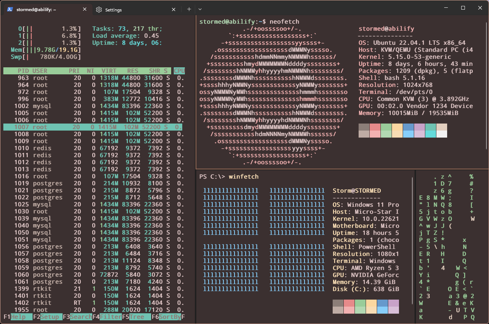
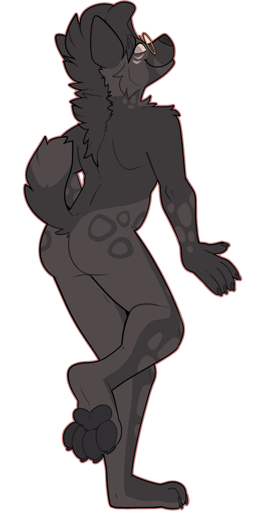

Demo
=========



## Whoa, what is this repo?

Butrin is a color scheme and configuration that I use for multiple terminals, including Windows Terminal, Alacritty, Kitty, etc. The color scheme is directly based off of my original character Abilify's color scheme; No association with big pharma!

I aim to provide a consistend and pleasant look across different terminal emulators and platorms. It also offers some features to enhance the productivity and usability of the terminal, such as using a tiling window manager keyboard layout (Windows Terminal Only). For a full list of keybindings, read below.
<br>

## Dependencies
As of right now, the [DroidSans Mono nerd font](https://github.com/ryanoasis/nerd-fonts/blob/master/patched-fonts/DroidSansMono/complete/Droid%20Sans%20Mono%20Nerd%20Font%20Complete%20Mono.otf "DroidSans Mono nerd font") is what I use, but is completely optional. Otherwise, no extra configuration needed.


## Windows 10/11 Installation:

Method 1 (easiest & recommended):
1. Open Windows Terminal
2. dropdown menu next to the tabs, select settings
3. "Open Json File"
4. the contents with the settings.json file in this repo
5. if you want just the theme, or just the keybindings, you can copy & paste the contents from theme-only.json / keybindings-only.json into your already existing config
6. reload windows terminal

## Method 2:
1. Open Windows Terminal as Administrator
2. Run the following commands below (be sure to replace <USER_NAME> with your login name)
	```sh
	git clone https://github.com/stormedx/butrin-terminal && cd butrin-terminal\windows-terminal
	```
	```sh
	copy C:\Users\<USER_NAME>\AppData\Local\Packages\Microsoft.WindowsTerminal_8wekyb3d8bbwe\LocalState\settings.json C:\Users\<USER_NAME>\AppData\Local\Packages\Microsoft.WindowsTerminal_8wekyb3d8bbwe\LocalState\settings.json.bak
	```

## Linux (WIP)

### Keybindings
| Function  | Key  |
| ------------ | ------------ |
| Cursor Keys (vim-style)  | h (left), l (right), k (up), j (down)  |
| Move between panes  | Alt + h / l / k / j  |
| Resize pane  | Alt + Shift + h / l / k / j  |
| New pane  |  Alt + n |
| New pane (stating direction to be placed)  | CTRL + Alt + h / l / k / j  |
| Close pane  |  Alt + w |
| Move pane  | CTRL + h / l / k / j  |
| Quake Terminal  | Alt + q  |
| New Tab  | CTRL +Shift + t  |
| New Tab (from dropdown menu)  | Alt + 1 / 2 / 3 / 4  |
***All other keys are default*** 


